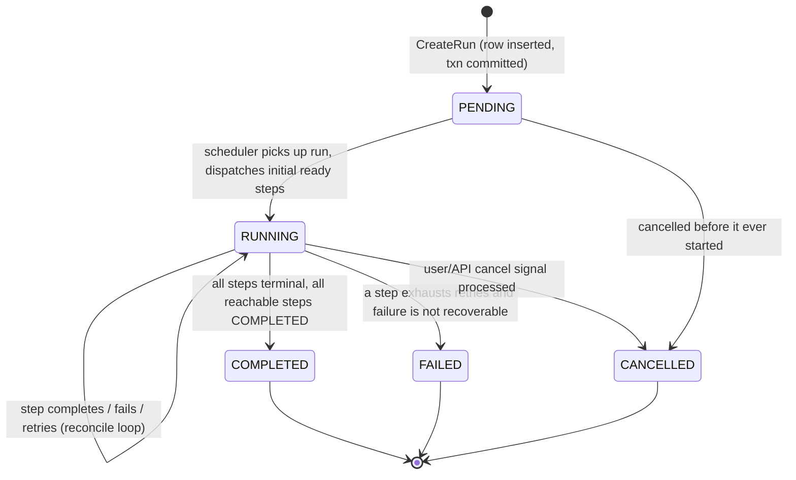
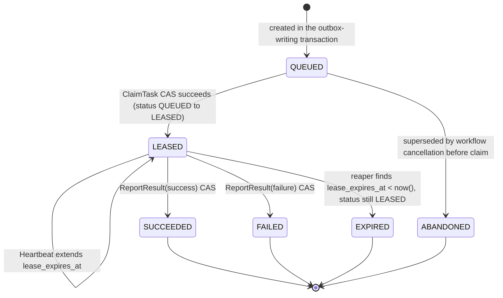
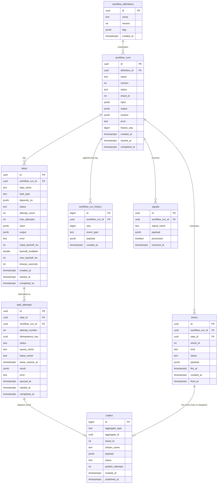

# DESIGN.md — Fault-Tolerant Workflow Orchestration Engine

This document is written **before** any code, per the project brief. It nails down the
state machine, the Postgres schema (incl. the transactional outbox), and the exactly-once
execution guarantee. Everything in Phase 1 and Phase 2 is implemented against this design;
where the implementation had to deviate, the deviation is called out in README.md.

## 0. Scope and an honest simplification vs. real Temporal

Temporal lets you write a workflow as arbitrary code and durably resumes it by
**event-sourced replay** of that code. That is a large amount of machinery (deterministic
execution, replay-safe SDKs, versioning). This project instead models a workflow as a
**declarative DAG** (JSON/YAML) of typed steps. That's a deliberate scope cut: it gets us
the interesting distributed-systems problems (durable execution across crashes, exactly-once
dispatch, retries/backoff, sharding, signals) without needing a replay engine, because the
"program" is just data sitting in Postgres. The orchestrator's scheduling decision is a
**pure function of DB state** — `reconcile(run_id)` looks at the rows for a run and decides
what to do next. That single property is what makes durability tractable: there is no
in-memory-only execution state anywhere. A crash loses nothing but a few milliseconds of
in-flight work, which is exactly what the restart test in Phase 1 verifies.

## 1. State machines

### 1.1 Workflow run states



### 1.2 Step states

A step is one DAG node inside a run. It may be attempted multiple times; each attempt is
a separate row in `task_attempts` (see schema). The step's own status is the coarse-grained
aggregate that the DAG scheduler reasons about; the attempt status is the fine-grained state
used for exactly-once dispatch.

```mermaid
stateDiagram-v2
    [*] --> PENDING: step row created at run-creation time
    PENDING --> READY: all `depends_on` steps COMPLETED
    READY --> QUEUED: task_attempt + outbox row inserted in same txn
    QUEUED --> RUNNING: worker successfully claims the attempt (gRPC ClaimTask CAS)
    RUNNING --> COMPLETED: worker ReportResult(success)
    RUNNING --> RETRY_BACKOFF: ReportResult(failure) or lease expiry, attempts remain
    RETRY_BACKOFF --> QUEUED: durable timer fires, next attempt scheduled
    RUNNING --> FAILED: ReportResult(failure) or lease expiry, attempts exhausted
    PENDING --> SKIPPED: an ancestor step FAILED (fail-fast propagation)
    READY --> SKIPPED: an ancestor step FAILED (race with dependency evaluation)
    QUEUED --> CANCELLED: workflow run cancelled while queued
    RUNNING --> CANCELLED: workflow run cancelled while running (best-effort; worker may still finish, result is discarded)
    COMPLETED --> [*]
    FAILED --> [*]
    SKIPPED --> [*]
    CANCELLED --> [*]
```



### 1.3 Task attempt states (the exactly-once dispatch unit)



The `QUEUED -> LEASED` and `LEASED -> {SUCCEEDED,FAILED}` transitions are implemented as
single `UPDATE ... WHERE id = $1 AND status = $expected RETURNING *` statements — that
`WHERE status = $expected` is the compare-and-swap. Redis Streams only promises
**at-least-once delivery**; this CAS is what turns that into **effectively-once state
transition**, and is the core of Section 3.

## 2. Postgres schema

All tables live in one Postgres database. Every write that must be atomic with a step's
scheduling decision goes through one transaction. Key design choice: **one outbox table
shared by all producers** (the DAG scheduler and the timer service both write to it), with a
`shard_id` column duplicated onto every run-scoped table so that sharded pollers (Phase 2)
can filter with an indexed `WHERE shard_id = ANY($1)` instead of joining back to
`workflow_runs` on every poll.



Full DDL is in `migrations/`. Notable indexes:
- `outbox (status, id) WHERE status = 'PENDING'` — partial index, the relay's hot query.
- `timers (status, fire_at) WHERE status = 'PENDING'` — the timer poller's hot query.
- `task_attempts (status, lease_expires_at) WHERE status = 'LEASED'` — the reaper's hot query.
- `steps (workflow_run_id, status)` — DAG reconciliation.
- `workflow_runs (shard_id, status) WHERE status = 'RUNNING'` — per-shard recovery scan.

### 2.1 The transactional outbox, precisely

The problem the outbox solves: we must never let a worker see a task for a DB transaction
that later rolls back, and we must never silently lose a task whose transaction *did*
commit (e.g., process dies between "commit DB" and "publish to Redis").

**Write path** (single Postgres transaction, always):
1. Compute newly-READY steps for a run (or a retry due to a fired timer).
2. `INSERT INTO task_attempts (...) VALUES (...)` — status `QUEUED`, fresh `idempotency_key`.
3. `INSERT INTO outbox (aggregate_type, aggregate_id, stream_name, payload, status) VALUES ('task_attempt', $attempt_id, 'wf:tasks:<queue>', $json, 'PENDING')`.
4. `INSERT INTO workflow_run_history (...)` — audit trail / dashboard feed.
5. `COMMIT`.

Because steps 2–4 are in the same transaction as the commit, a task is **never visible to
any worker before the transaction that created it durably commits** — this satisfies the
Phase 1 constraint directly. If the transaction rolls back (e.g., a serialization failure),
none of it happened; there is no outbox row to publish and no task to claim.

**Relay path** (background goroutine, one or more instances, safe to run concurrently):
1. `SELECT * FROM outbox WHERE status = 'PENDING' ORDER BY id LIMIT 100 FOR UPDATE SKIP LOCKED`.
2. For each row: `XADD <stream_name> * task_attempt_id ... idempotency_key ...` (Redis Streams).
3. `UPDATE outbox SET status = 'PUBLISHED', published_at = now() WHERE id = $1`.

Steps 2 and 3 are **not** atomic with each other (XADD is a separate system from Postgres;
there is no cross-system 2PC here by design — that's the standard, well-understood tradeoff
of the outbox pattern). If the relay crashes between 2 and 3, row 1 stays `PENDING` and gets
republished on the next poll: **at-least-once publish**. Section 3 explains why a duplicate
publish is harmless. `FOR UPDATE SKIP LOCKED` means multiple relay instances (one per server
node, no leader needed for this specific loop) never double-process the same row concurrently,
though restart-induced duplicates across time are still possible and expected.

## 3. Guaranteeing exactly-once *task execution*

Being precise about what "exactly-once" can mean in a distributed system: we guarantee
**exactly-once effective state transition** per task attempt (the attempt's terminal
status and result are recorded exactly once, and a task handler's business logic is invoked
*by the orchestrator's bookkeeping* at most once as far as the orchestrator can enforce). We
cannot force a worker's arbitrary side effect (e.g. "call a third-party payment API") to be
exactly-once at the network level — no orchestrator can, including Temporal, which documents
the identical caveat. What we *can* and *do* guarantee end-to-end:

1. **No duplicate scheduling from the DB side.** A step transitions `READY -> QUEUED` exactly
   once because that transition, and the outbox row that announces it, happen in one
   transaction guarded by the step's own status check (`UPDATE steps SET status='QUEUED'
   WHERE id=$1 AND status='READY'`). Two reconcile loops racing (e.g. during a sharding
   rebalance window) will have exactly one `UPDATE` succeed; the other affects 0 rows.

2. **At-least-once delivery, deduped by CAS claim.** Redis Streams consumer groups (`XREADGROUP`)
   guarantee a message is delivered to some consumer, and redelivers it (via the pending-entries
   list, reclaimed with `XCLAIM` after an idle timeout) if never acknowledged. A worker that
   receives a task (possibly a redelivery, possibly a duplicate from an outbox relay restart)
   must first call `ClaimTask` over gRPC:
   ```sql
   UPDATE task_attempts
      SET status = 'LEASED', lease_owner = $worker_id, lease_expires_at = now() + $lease_dur, started_at = now()
    WHERE id = $attempt_id AND idempotency_key = $key AND status = 'QUEUED'
   RETURNING *;
   ```
   Only the **first** claim (whichever worker/redelivery gets there first) can match
   `status = 'QUEUED'`. Every subsequent claim of the same attempt — whether from a genuine
   Streams redelivery, a crashed-and-retried worker, or a duplicate outbox publish — sees 0
   rows updated, is told `ALREADY_CLAIMED`, and simply `XACK`s the message without ever
   invoking the task handler. **This is the actual exactly-once boundary**: the task handler
   runs at most once per attempt, enforced by a single-row CAS, not by trusting the queue.

3. **Idempotent result reporting.** `ReportResult` is likewise a CAS
   (`WHERE id=$1 AND status='LEASED' AND lease_owner=$worker_id`). If a worker's process is
   slow/retries the RPC (e.g. due to a network blip after the DB write already landed), the
   second call matches 0 rows and the handler returns the already-recorded terminal state
   instead of erroring — reporting is safe to retry.

4. **Lease expiry closes the crash gap.** If a worker claims a task and then dies before
   reporting, the attempt is stuck `LEASED` forever unless something notices. A reaper
   (`internal/leases`) periodically does
   `UPDATE task_attempts SET status='EXPIRED' WHERE status='LEASED' AND lease_expires_at < now() RETURNING *`,
   then hands each expired attempt to the same retry-scheduling code path used for a reported
   failure (new attempt via a durable timer, or terminal `FAILED` if attempts are exhausted).
   Because this is a DB-driven CAS too, it can never race incorrectly with a
   worker that is in fact still alive and reports late: if the worker's late `ReportResult`
   arrives after the reaper already flipped the row to `EXPIRED`, the CAS condition
   `status='LEASED'` no longer holds, so the late report is a no-op (logged, not applied) —
   the reaper's decision wins, and the (already-superseded) old attempt's result is simply
   discarded. The *new* attempt spawned by the reaper is what continues the workflow.

5. **Idempotency key surfaced to task handlers.** Every `ClaimTask` response includes the
   attempt's `idempotency_key`. Task handler authors are expected to use it as the dedup key
   for any *external* side effect they perform (e.g., pass it as a Stripe `Idempotency-Key`
   header) — this is the honest, standard way distributed orchestrators extend the
   exactly-once guarantee out to the edge of the system they don't control.

Net effect: from the outside, a step's task type is invoked once per logical attempt, attempts
are capped and backed off, and the workflow's recorded outcome is never duplicated or lost —
even though every layer underneath (Postgres commit, outbox relay, Redis Streams, gRPC) only
individually promises at-least-once or best-effort delivery.

## 4. Durable timers and why no clock sync is required

A naive retry-backoff implementation would do `time.Sleep` in a goroutine — that state dies
with the process. Instead, "wait N seconds" is represented as a **row** in `timers` with a
`fire_at` timestamp, written in the same transaction that marks the attempt `RETRY_BACKOFF`.
A separate timer service polls `SELECT * FROM timers WHERE status='PENDING' AND fire_at <= now() ... FOR UPDATE SKIP LOCKED`
and, on firing, runs the exact same "create next attempt + outbox row" transaction the initial
scheduler uses.

Because `now()` in that query is evaluated **by the Postgres server**, and `fire_at` was
computed as `<postgres now()> + backoff` at write time, every comparison that decides whether
a timer is due happens against a **single clock** (Postgres's), never against a worker's or a
server node's local wall clock. Multiple server instances can run the timer poller concurrently
(again via `SKIP LOCKED`) and will agree on which timers are due without needing NTP-level
synchronization between themselves — they only need to be able to reach Postgres and ask it
"what time is it," which sidesteps distributed clock skew entirely. The only place a local
clock matters at all is lease expiry checks and heartbeat TTLs, and those too are computed
as `now() + duration` and compared inside the same database, for the same reason.

## 5. Sharding: consistent hashing, and why it's a scaling knob, not a correctness mechanism

Every `workflow_runs` row gets `shard_id = hash(id) % NUM_SHARDS` (`NUM_SHARDS = 256`) at
creation, stamped once and never recomputed. A **leader**, elected via a Redis
`SET orchestrator:leader NX PX 15000` lock (renewed every 5s, re-contended on loss), is the
sole writer of a `orchestrator:shardmap` key: it builds a consistent-hash ring (with virtual
replicas per node for smoother distribution) over the currently-live server nodes — liveness
determined from `node:<id>` heartbeat keys with a TTL — and maps each of the 256 shards to a
node. Every node (leader included) independently reads that map on a timer and computes its
own owned shard set; its reconcile loop, outbox relay poll, and timer poll all add
`AND shard_id = ANY($owned)` to their queries.

**Why this doesn't need to be correct to be correct**: every scheduling transition described
in Section 3 is already guarded by a CAS on the affected row. If shard ownership is briefly
inconsistent (e.g., mid-rebalance, two nodes both believe they own shard 17), both may attempt
to reconcile the same run concurrently — and that's fine, because the underlying `UPDATE ...
WHERE status = $expected` statements make the second actor's attempt a no-op. Sharding exists
purely so that, at scale, N server nodes divide the polling/scanning work by ~N instead of
each node scanning the entire `workflow_runs`/`outbox`/`timers` tables — a throughput and lock
contention optimization, not a safety property. This is called out explicitly because it's a
common source of over-engineering: teams build leader-election-gated correctness when a
CAS-based design would have made the leader election optional for correctness and valuable
only for efficiency, which is the case here.

## 6. Signals and queries

- **Signal** (write path): `POST /api/runs/{id}/signal {name, payload}` inserts a row into
  `signals` and a `workflow_run_history` event in one transaction, then nudges the reconcile
  loop for that run. Two built-in signal names are handled specially by the engine:
  `__cancel__` (transitions the run to `CANCELLED`, propagating to non-terminal steps) and
  any name matching a step of DAG-declared type `signal_wait`, which transitions that step
  from `WAITING` to `COMPLETED` with `output = payload` the next time reconcile runs and finds
  an unconsumed matching signal row (`processed = false`), marking it consumed in the same
  transaction (again a CAS: `UPDATE signals SET processed = true WHERE id = $1 AND processed = false`).
- **Query** (read path): `GET /api/runs/{id}` and `GET /api/runs/{id}/steps` are pure reads of
  current DB state — no in-memory workflow replay is needed (unlike Temporal, which must
  replay workflow code to answer a query) precisely because of the Section 0 simplification:
  our "workflow program" is already fully externalized as rows, so a query is just a `SELECT`.

## 7. Pluggable backends

Two Go interfaces sit between the engine and its infrastructure:

- `internal/store.Store` — every operation the engine needs (transactions, run/step/attempt
  CRUD, outbox, timers, signals, history) as an interface. `internal/store/postgres` is the
  real implementation (`pgx`); `internal/store/memory` is a full in-process implementation
  used by unit tests (no Docker required to run `go test ./...` on the engine package).
- `internal/queue.Queue` — `Publish`, `Consume` (returns a channel + ack/nack handles),
  `Ack`. `internal/queue/redisstream` is the real implementation; `internal/queue/memory` is
  an in-process implementation for tests.

Swapping either is a one-line change in `cmd/server/main.go` / `cmd/worker/main.go` (wire the
concrete type into the same interface-typed field). See README "Pluggable backends" section
for the exact interface listings once implemented.

## 8. Deviations tracker

Any place the implementation diverges from this design (bug found during build, a
simplification that turned out to be necessary, etc.) is recorded in README.md's
"Deviations from DESIGN.md" section rather than silently edited in here, so this document
stays a record of the up-front design decision.
