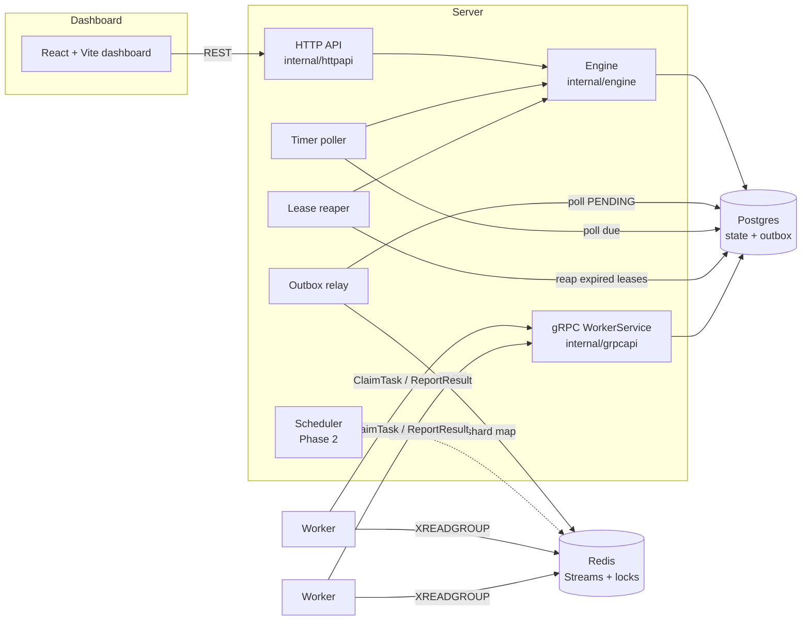
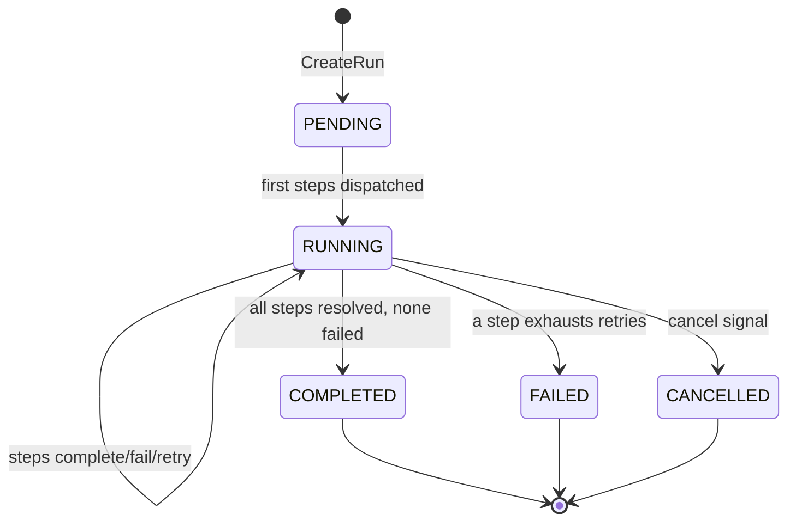
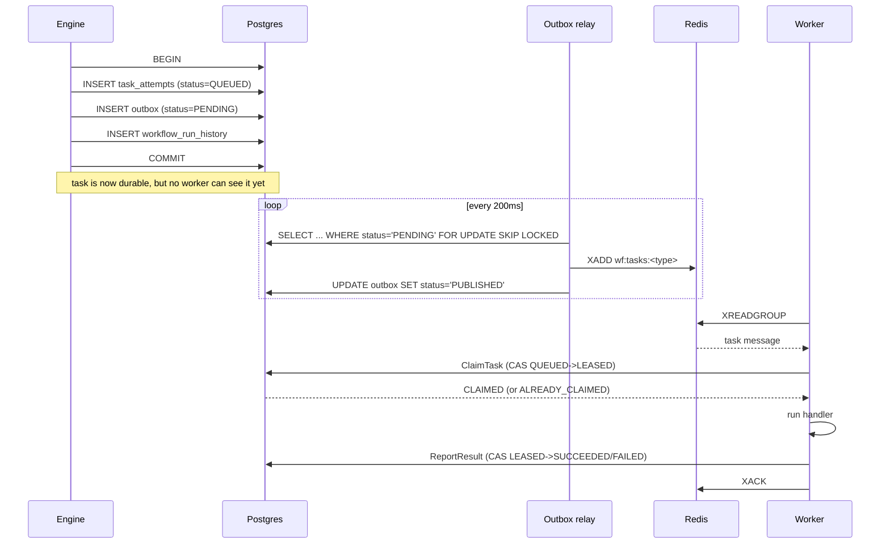
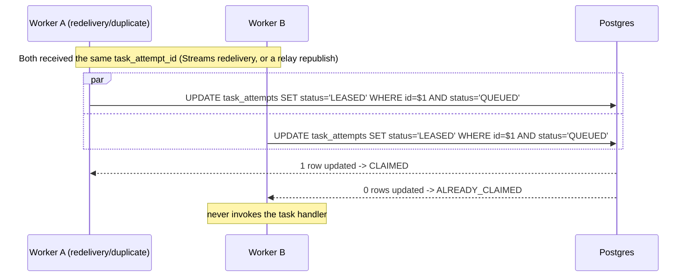

# Workflow Orchestrator

A minimal, from-scratch, fault-tolerant workflow orchestration engine — the same category of
problem as Temporal / Airflow / AWS Step Functions, scoped down to a portfolio-sized project
that still takes durability seriously. Workflows are declarative DAGs (JSON/YAML); the engine
schedules steps, dispatches them to workers over Redis Streams with a Postgres-backed
transactional outbox, retries with exponential backoff via durable (DB-polled, not in-memory)
timers, and survives the server process being killed mid-workflow.

Read **[DESIGN.md](DESIGN.md)** first — it's the up-front design (state machines, schema,
exactly-once dispatch, sharding) that everything here is built against, including a section
on deliberate simplifications vs. real Temporal. This file covers how the pieces fit
together operationally, how to run it, and what was actually measured.

## Contents

- [Architecture at a glance](#architecture-at-a-glance)
- [The state machine](#the-state-machine)
- [The outbox flow](#the-outbox-flow)
- [Exactly-once dispatch, in one picture](#exactly-once-dispatch-in-one-picture)
- [Phase 1 features](#phase-1-features)
- [Phase 2 features and their tradeoffs](#phase-2-features-and-their-tradeoffs)
- [Pluggable backends](#pluggable-backends)
- [Running it](#running-it)
- [Testing](#testing)
- [The durability test](#the-durability-test-actually-run-not-just-written)
- [Load test results and bottleneck analysis](#load-test-results-and-bottleneck-analysis)
- [Project structure](#project-structure)
- [Deviations from DESIGN.md](#deviations-from-designmd)

## Architecture at a glance



## The state machine



Each step inside a run has its own, finer-grained state machine
(`PENDING → READY → QUEUED → RUNNING → COMPLETED|RETRY_BACKOFF→...→FAILED|SKIPPED`), and each
dispatch attempt of a step has its own exactly-once-oriented state machine
(`QUEUED → LEASED → SUCCEEDED|FAILED|EXPIRED`). Both are diagrammed in full in
[DESIGN.md section 1](DESIGN.md#1-state-machines) — this file keeps the top-level picture
since that's what you inspect from the dashboard.

## The outbox flow



The critical property: **a task is only ever visible to a worker after the transaction that
created it has committed**, because the outbox insert and the state transition that created it
are the same Postgres transaction. See [DESIGN.md section 2.1](DESIGN.md#21-the-transactional-outbox-precisely)
for the full writeup, including what happens if the relay crashes mid-batch (answer: harmless
re-publish, because claiming is itself a CAS — see next section).

## Exactly-once dispatch, in one picture



Full explanation, including the lease-expiry reaper that closes the "worker crashed after
claiming" gap, is in [DESIGN.md section 3](DESIGN.md#3-guaranteeing-exactly-once-task-execution).

## Phase 1 features

- Workflows defined as JSON/YAML DAGs (`internal/workflowdsl`), with validation (cycle
  detection, unknown-dependency detection, at-least-one-root-step) and sane retry/timeout
  defaults.
- Sequential and parallel step execution — a step becomes dispatchable the instant *all* its
  `depends_on` are `COMPLETED`; independent steps fan out in the same reconcile pass
  (`internal/engine/reconcile.go`).
- Retries with exponential backoff + jitter, capped, per step (`max_attempts`,
  `initial_backoff_ms`, `backoff_multiplier`, `max_backoff_ms`) and a per-step `timeout_seconds`.
- Durable execution via DB-backed state: the engine's `reconcileTx` is a pure function of
  Postgres state (DESIGN.md section 0), so a server restart just re-runs it — verified by an
  actual `kill -9` test, see below.
- Workers pull tasks from Redis Streams and report results back over gRPC
  (`proto/worker.proto`, `internal/grpcapi`, `internal/worker`).
- Idempotency keys on every task attempt, surfaced to task handlers for their own external
  side-effect dedup.
- React dashboard (`frontend/`) for live run inspection: run list with status filters, per-run
  step/attempt/history drill-down, worker fleet view, cluster/sharding view, and forms to
  start runs, register definitions, send signals, and cancel runs.

## Phase 2 features and their tradeoffs

- **Sharded scheduler** (`internal/scheduler`): consistent hashing (32 virtual replicas/node)
  over 256 fixed shards, with a Redis-`SETNX`-elected leader as the sole writer of the
  shard→node assignment map. *Tradeoff*: sharding here is a **throughput optimization, not a
  correctness mechanism** — every scheduling transition is independently guarded by a
  Postgres CAS, so momentarily-stale shard ownership during a rebalance can never cause a
  duplicate dispatch, only redundant work. Disabled by default (`ENABLE_SHARDING=false`)
  because a single node correctly "owns everything" without it; enabling it is a pure
  scale-out knob. See DESIGN.md section 5 for the full argument.
- **Durable timers** (`internal/timers`): retry backoff and future work are rows in a
  `timers` table with a `fire_at` timestamp, polled by comparing against Postgres's own
  `now()` — never a worker's or server's local wall clock. *Tradeoff*: polling (200ms
  interval) instead of a push-based scheduler trades a small, bounded latency floor
  (empirically measured below) for radical simplicity and zero extra moving parts; see
  DESIGN.md section 4 for why this sidesteps clock-sync entirely, and the load test report
  below for exactly how much latency it costs.
- **Signals and queries** (`internal/engine` `ApplySignal`, HTTP `POST /runs/{id}/signal`):
  external events can resolve a `signal_wait` step or cancel a run; queries are just reads of
  current DB state. *Tradeoff*: because this project models workflows as data (a DAG) rather
  than arbitrary replayable code, queries never need Temporal-style workflow-code replay —
  cheap, but it's why "signals" here can only affect declared `signal_wait` steps / cancel,
  not arbitrary in-flight workflow logic.
- **Pluggable persistence/queue backends** (`internal/store.Store`, `internal/queue.Queue`):
  real interfaces, not aspirational ones — `internal/store/postgres` and
  `internal/store/memory` both fully satisfy `store.Store` (the latter backs every unit test
  in `internal/engine`, no Docker required); `internal/queue/redisstream` and
  `internal/queue/memory` both fully satisfy `queue.Queue`. Swapping either is a one-line
  change in `cmd/server/main.go` / `cmd/worker/main.go`. *Tradeoff*: this is the standard
  "interface at the persistence boundary" pattern — it costs an extra layer of indirection
  and hand-written SQL (no ORM/codegen) in exchange for being honestly swappable and for
  making the engine's unit tests fast and Docker-free.
- **Load test** (`loadtest/`): see the [dedicated section](#load-test-results-and-bottleneck-analysis) below.

## Pluggable backends

```go
// internal/store/store.go
type Store interface {
    Queries
    WithTx(ctx context.Context, fn func(ctx context.Context, q Queries) error) error
    Close()
}
// Queries has ~30 methods: definitions, runs, steps, task attempts (incl. the CAS
// ClaimTaskAttempt/CompleteTaskAttempt), outbox, timers, signals, history.

// internal/queue/queue.go
type Queue interface {
    EnsureGroup(ctx context.Context, stream, group string) error
    Publish(ctx context.Context, stream string, payload []byte) (string, error)
    Consume(ctx context.Context, stream, group, consumer string, idleTimeout time.Duration) (<-chan Message, error)
    Ack(ctx context.Context, stream, group, id string) error
    Close() error
}

// internal/lock/lock.go
type Locker interface {
    TryAcquire(ctx context.Context) (bool, error)
    Renew(ctx context.Context) (bool, error)
    Release(ctx context.Context) error
    HolderID() string
}
```

| Interface | Real implementation | Test/in-memory implementation |
|---|---|---|
| `store.Store` | `internal/store/postgres` (pgx) | `internal/store/memory` |
| `queue.Queue` | `internal/queue/redisstream` | `internal/queue/memory` |
| `lock.Locker` | `internal/lock/redislock` | *(not needed for tests — scheduler tests exercise the ring/assignment logic directly)* |

## Running it

### With Docker Compose (recommended)

```bash
cp .env.example .env   # optional; defaults already work
docker compose up -d --build
```

This starts Postgres, Redis, the server, 2 worker replicas, and the dashboard. Host ports are
deliberately non-default to avoid clobbering anything else you have running locally:

| Service | Host port | Notes |
|---|---|---|
| Dashboard | http://localhost:3002 | |
| Server HTTP API | http://localhost:8080 | `/healthz`, `/api/...` |
| Server gRPC | localhost:9091 | container-internal 9090; host-mapped to 9091 |
| Postgres | localhost:5433 | container-internal 5432 |
| Redis | localhost:6380 | container-internal 6379 |

Verify end-to-end:

```bash
curl -X POST localhost:8080/api/definitions --data-binary @examples/simple-sequential.yaml -H "Content-Type: application/yaml"
curl -X POST localhost:8080/api/runs -d '{"name":"simple-sequential"}'
# open http://localhost:3002 and watch it complete
```

### Without Docker

```bash
# Postgres + Redis however you like, e.g.:
docker run -d -p 5432:5432 -e POSTGRES_USER=orchestrator -e POSTGRES_PASSWORD=orchestrator -e POSTGRES_DB=orchestrator postgres:16-alpine
docker run -d -p 6379:6379 redis:7-alpine

go run ./cmd/server                      # migrations run automatically on startup
WORKER_CONCURRENCY=4 go run ./cmd/worker # run 1-2 more in separate terminals for parallelism

cd frontend && npm install && npm run dev  # http://localhost:5173, proxies /api to :8080
```

All configuration is environment variables with local-dev defaults baked in — see
`internal/config/config.go` and `.env.example` for the full list. `ENABLE_SHARDING=true`
turns on the Phase 2 leader-election/consistent-hashing loops if you want to run multiple
server instances against the same Postgres/Redis.

## Testing

```bash
go build ./...     # whole repo, including cmd/server, cmd/worker, loadtest
go vet ./...
go test ./...       # unit tests (engine, workflowdsl) + the e2e durability test (see below)
cd frontend && npm run build   # typechecks (tsc -b) then builds
```

`go test ./...` includes `test/e2e`, which needs a reachable Postgres/Redis; it **skips**
(not fails) if neither is reachable, defaulting to the ports `docker-compose.yml` maps them to
on the host (`localhost:5433` / `localhost:6380` — so `docker compose up -d postgres redis`
is all you need before running it), or override with `E2E_DATABASE_URL` / `E2E_REDIS_ADDR`.
CI without Docker still goes green either way.

## The durability test (actually run, not just written)

`test/e2e/restart_test.go`'s `TestServerRestartMidWorkflow` does exactly what the project
brief asks for, as real OS processes — not a mock:

1. Compiles the real `cmd/server` binary (`go build`).
2. Starts it as a subprocess against a real Postgres/Redis.
3. Registers a 6-step sequential workflow and starts a run, with an in-process worker (real
   gRPC client, real Redis Streams consumer) executing steps.
4. Waits for **genuine partial progress** (asserts 2–5 of 6 steps done, failing the test if
   the workflow raced to completion before the kill — i.e. it verifies its own precondition).
5. **`cmd.Process.Kill()`** on the server — Go's `Kill()` always sends `SIGKILL`, i.e. this
   really is `kill -9`, no graceful shutdown path is invoked.
6. Restarts the same binary against the same database.
7. Asserts the run reaches `COMPLETED` and all 6 steps show `COMPLETED`.

Actually run (this exact output, `-count=1` to bypass the test cache, three consecutive
invocations to check for flakiness):

```
$ go test ./test/e2e/... -run TestServerRestartMidWorkflow -count=1 -v
...
    restart_test.go:281: started run 41b2136b-...
    2026/07/09 16:34:42 INFO worker: handler succeeded ... step=step1 attempt=1
    2026/07/09 16:34:42 INFO worker: handler succeeded ... step=step2 attempt=1
    restart_test.go:304: pre-kill: 2/6 steps completed
    restart_test.go:311: server killed with SIGKILL
    2026/07/09 16:34:42 ERROR worker: claim rpc failed, will be redelivered ... step=step3
    2026/07/09 16:34:42 ERROR worker: claim rpc failed, will be redelivered ... step=step4
    restart_test.go:323: server restarted
    2026/07/09 16:34:45 INFO worker: handler succeeded ... step=step3 attempt=1
    2026/07/09 16:34:45 INFO worker: handler succeeded ... step=step4 attempt=1
    2026/07/09 16:34:45 INFO worker: handler succeeded ... step=step5 attempt=1
    2026/07/09 16:34:45 INFO worker: handler succeeded ... step=step6 attempt=1
    restart_test.go:354: counted_step handler ran 6 times across 6 steps
    restart_test.go:357: PASS: workflow survived a SIGKILL of the server process mid-flight and completed correctly after restart
--- PASS: TestServerRestartMidWorkflow (4.97s)
PASS
```

Three consecutive `-count=1` runs: **4.97s, 6.19s, 6.32s — all PASS**, no flakes.

The most interesting case it actually exercised on the first honest run (before the test
workflow's `max_attempts` was tuned up from the default of 1): a step's handler had *already
finished executing* on the worker side, but the worker's `ReportResult` RPC landed in the
exact instant the server was killed, so the result was lost. That step's `task_attempt` sat
`LEASED` until the reaper (polling every 1s, lease duration shortened to 3s for the test)
expired it, at which point the engine treated it exactly like a reported failure — either
scheduling a durable retry timer or failing the run, depending on `max_attempts`. That's
`DESIGN.md` section 3, point 4 (the lease-expiry reaper closing the "crash after claim, before
report" gap), observed for real, not just designed on paper.

## Load test results and bottleneck analysis

Full methodology, results table, and reproduction steps: `loadtest/main.go` is the harness
(`go run ./loadtest -rate 20 -duration 20s`); this section is the write-up.

**Setup**: 1 server, 3 worker processes (`WORKER_CONCURRENCY=16` each, 48 task slots total),
Postgres 16 / Redis 7 in Docker with no tuning, on a 12-vCPU/7.6GB dev machine. Workflow:
12 steps (`loadtest-12step`), all `noop` handlers — 2 sequential intro steps, a 3-way parallel
fan-out (branches of 3/3/2 steps), a fan-in join, 1 final step (7 "waves" on the critical
path). Near-zero handler compute isolates *orchestration* overhead, which is the point.

| Target rate | Runs | Completed | Failed | `POST /api/runs` p50/p99 | End-to-end p50/p99 |
|---|---|---|---|---|---|
| 10/s × 20s | 200 | 100% | 0 | 13ms / 28ms | 9.9s / 19.7s |
| 20/s × 20s | 400 | 100% | 0 | 11ms / 37ms | 10.0s / 19.8s |
| 20/s × 15s | 300 | 100% | 0 | 10ms / 32ms | 7.5s / 14.8s |
| 40/s × 20s | 800 | 100% | 0 | 31ms / 76ms | 10.1s / 19.8s |

**Throughput held at every rate tested, up to 40 workflows/sec (480 orchestrated steps/sec)
with zero failures and no unbounded backlog growth** (`outbox`/`task_attempts` queues were
polled directly during the 20/s run and stayed in the 30–60 row range, never growing without
bound, and fully drained after the launch window closed). The system degrades by getting
*slower*, not by dropping or corrupting work.

**Where the bottleneck is: Postgres commit/WAL overhead from many small per-step
transactions — not CPU, not Redis, not gRPC.**

- An isolated single run (no concurrent load) takes ~1.4s for the 7-wave DAG — almost exactly
  **200ms/wave**, matching the outbox relay's poll interval exactly (its latency floor).
- Under load, p50 jumps to ~10s (~7x), even though the outbox backlog stays bounded — ruling
  out relay batch throughput (500/s capacity, far above the ~120–480/s actually needed) as
  the ceiling.
- `docker stats` during a 20/s run: **Postgres ~108% CPU** (just over 1 of 12 cores, with
  heavy block I/O — ~300MB written for 300 runs), **Redis ~7% CPU**. Postgres is under
  pressure and *not* spreading across cores — a signature of serialized WAL/commit overhead,
  not parallelizable compute.
- Why: every step transition is deliberately its own ACID transaction (that's the point of
  the outbox pattern and the CAS-based exactly-once design). Dispatch is 1 txn, claim is 1
  txn, and `ReportResult` → `reconcileTx` is 1 txn that does several sequential round trips
  (get step, get run, update step, get *all* steps in the run, then per newly-ready step:
  insert attempt + insert outbox + update step + append history). At 40/s × 12 steps × ~3
  txns/step ≈ 1,400 small, `fsync`'d transactions/sec — the classic small-OLTP-transaction
  ceiling, and Postgres's WAL is fundamentally a single append-only stream (explains the
  "~1 core, not 12" CPU signature).

**What would fix it** (not implemented — noted honestly rather than silently left out):
batch the per-ready-step inserts in `reconcileTx` into fewer multi-row statements instead of
a per-step loop; tune `pgxpool`'s pool size alongside Postgres's (untouched default)
`max_connections=100`; shrink the outbox poll interval (200ms → 25–50ms) or add
`LISTEN/NOTIFY`-woken dispatch on top of the polling fallback to cut the per-wave latency
floor; consider `synchronous_commit=off` for the hot tables as a deliberate,
documented durability/throughput tradeoff. **Sharding would not help this specific
bottleneck** — per DESIGN.md section 5, it partitions *which node* reconciles a run, not
Postgres's own commit capacity, since every node still talks to the same single Postgres
instance.

## Project structure

```
proto/worker.proto        gRPC contract between server and workers
gen/workerpb/              generated Go from the proto (protoc-gen-go, protoc-gen-go-grpc)
internal/store/            Store/Queries interfaces + postgres and memory implementations
internal/queue/             Queue interface + redisstream and memory implementations
internal/lock/               Locker interface + redislock implementation
internal/workflowdsl/     YAML/JSON DAG parsing and validation
internal/engine/            the orchestration core: reconcile loop, retries, signals, recovery
internal/outbox/            transactional outbox relay (Postgres -> Redis Streams)
internal/timers/             durable timer poller
internal/leases/              lease-expiry reaper
internal/scheduler/         consistent hashing + Redis leader election (Phase 2)
internal/grpcapi/            WorkerService gRPC server (claim/report/heartbeat)
internal/httpapi/            REST API for the dashboard
internal/worker/              worker runtime (used by cmd/worker and the e2e test)
internal/workers/            Redis-backed worker-fleet registry (dashboard visibility only)
internal/config/             environment-variable configuration
cmd/server/                   server binary
cmd/worker/                   worker binary with demo task handlers
loadtest/                     load-test harness (see above)
test/e2e/                     the kill -9 restart durability test
examples/                     ready-to-run example workflow DAGs
frontend/                     React + Vite + TypeScript dashboard
migrations embedded in internal/store/postgres/migrations/
```

## Deviations from DESIGN.md

- **YAML parsing of object-typed step `input` fields** required normalizing through a generic
  `any` and re-marshaling to JSON before decoding into `Definition` (`internal/workflowdsl/dsl.go`) —
  `yaml.v3` cannot unmarshal a YAML mapping node directly into a `json.RawMessage` field, since
  it has no notion of "capture this subtree as raw JSON" the way `encoding/json` does. Design
  intent (validated DAG → canonical JSON) is unchanged; only the parse path gained a step.
  Covered by `TestParseYAMLWithMapInput`.
- **Timer firing** was originally specced as a single atomic "select + flip to FIRED" batch
  operation (mirroring the outbox relay's `FOR UPDATE SKIP LOCKED` pattern). It was changed
  during implementation to a two-step **non-mutating candidate scan** (`ListDueTimers`) plus a
  **per-timer CAS claim** (`FireTimerCAS`) performed by the engine in the *same transaction* as
  the retry it triggers. This is strictly better than the original plan: it makes "timer
  fired" and "next attempt dispatched" atomic together, rather than two separate transactions
  with a crash window between them. Documented in DESIGN.md section 4's implementation as the
  authoritative version; this note exists so the divergence from the earliest draft isn't silent.
- **`max_attempts` defaults to 1 (no retry)** unless a workflow definition sets it higher. This
  surfaced directly while building the durability test: a step killed mid-flight with no retry
  budget left correctly fails the run rather than being silently retried — which is correct
  engine behavior, but meant the first version of the durability test's workflow (default
  `max_attempts`) legitimately failed after a crash landed on an already-executing step, and
  the test had to set `max_attempts: 3` to exercise the retry-after-crash path it's meant to
  demonstrate. Left as-is because it's the right default (opt-in retries, not implicit ones).
- **No separate `loadtest/REPORT.md`.** The load-test write-up lives in this README instead of
  a standalone report file, to keep the actual data next to how to reproduce it rather than in
  a second document that could drift out of sync.
